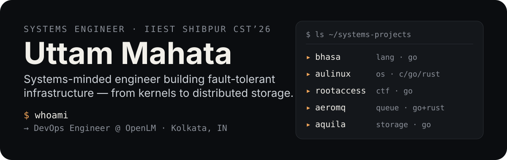

  

## ▸ Real Systems Work

| Project | What it does | Stack |
| --- | --- | --- |
| **[RootAccess](https://github.com/Uttam-Mahata/RootAccess)** | Full-stack CTF platform — challenge hosting, scoring, and an admin flow, deployed serverless | Go (Gin) · Angular |
| **[bhasa](https://github.com/Uttam-Mahata/bhasa)** | A compiled programming language with Bengali keywords | Go |
| **[aulinux](https://github.com/Uttam-Mahata/aulinux)** | Building a custom Linux distribution from scratch | C · Go · Rust |
| **[AeroMQ](https://github.com/Uttam-Mahata/AeroMQ)** | Distributed message queue — Go control plane, Rust data plane | Go · Rust |
| **[aquila](https://github.com/Uttam-Mahata/aquila)** | Framework for tamper-resistant, encrypted, searchable storage | Go |
| **[CourseWagon](https://github.com/Uttam-Mahata/coursewagon)** | GenAI-powered course & curriculum builder | Python (FastAPI) · Angular |

## ▸ Focus

- **Operating Systems** — process scheduling, memory management, concurrency, virtualization
- **Distributed Systems** — consensus, consistency models, fault tolerance
- **Networks & Security** — TCP/IP internals, cryptography, applied cybersecurity
- **DevOps & Cloud** — CI/CD, containerization, infrastructure as code

## ▸ Tech Stack

## ▸ Activity

## ▸ Connect

